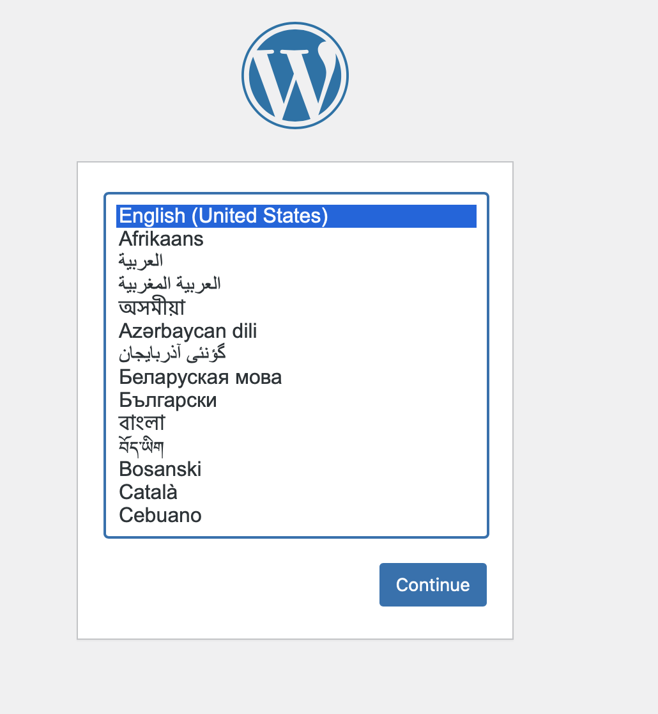
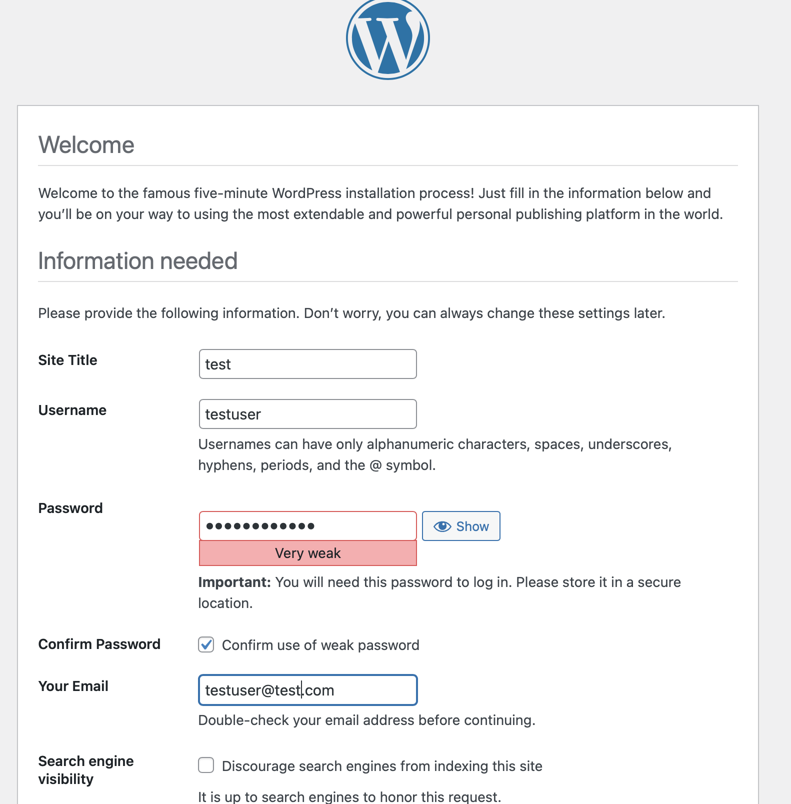
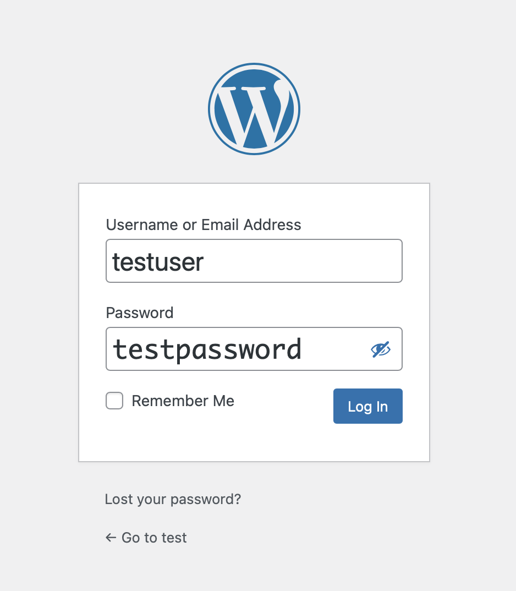
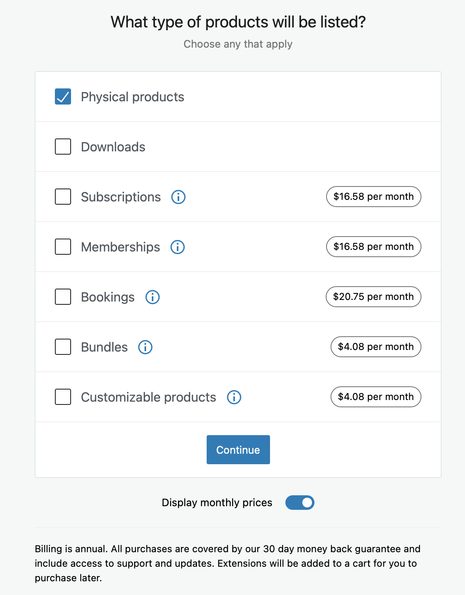
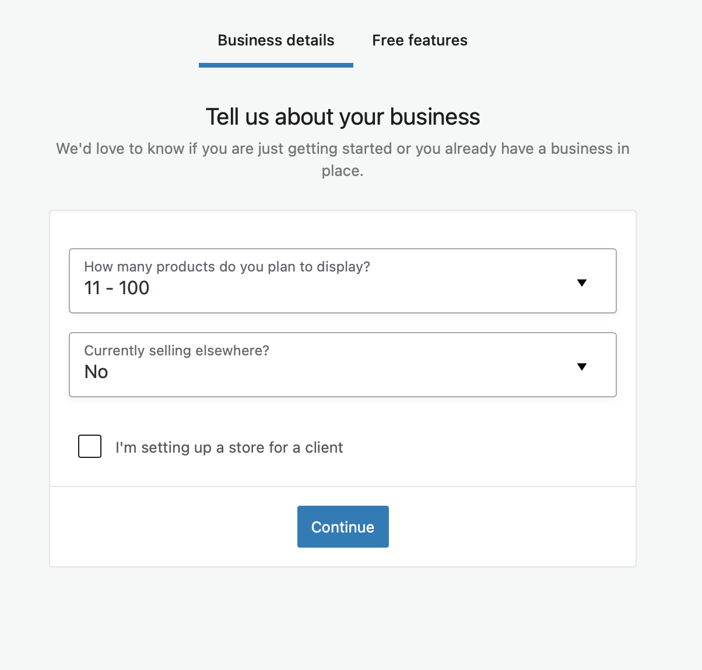
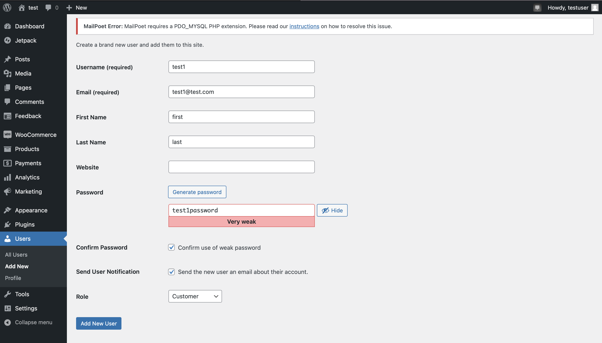
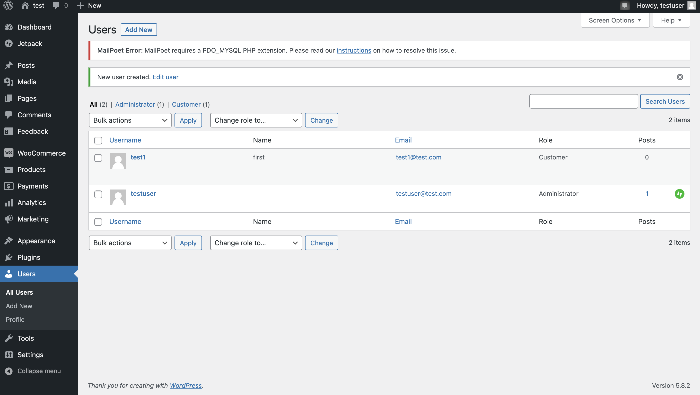

Execute the following command to  access the databse using mysql client as a root user

`docker-compose exec db  mysql -u root -p`{{execute}}

You need to enter the password:
`mypassword`{{copy}}

# After enter the database
You can view the databases by:
 `show databases;`{{execute}}

# You may also visit the woocommerce website

View the Home page at port 8080 
 
http://[[HOST_SUBDOMAIN]]-8080-[[KATACODA_HOST]].environments.katacoda.com/wp-login.php
 

# Setup
First, need to setup the webapge
 
Choose English as language

 
Then ,create the webapge with following information

username: testuser
 
password: testpassword
 
email: testuser@test.com
 

# Login
You can login the webpage by 
Username:`testuser`{{copy}}
Password:`testpassword`{{copy}}

# After log in

Create the woocommerce site by install plugin

 
You need to type the following to start the store

 

Select fashion,apparel and accessories as industry

 
Select physical products as product to sell

 
11-100 as number of product

 
Select the default theme

 
After that , need to create a new user to browse the store

 
Here is the list of user

 

# After the above step
open the following by the new account:
 
https://[[HOST_SUBDOMAIN]]-8080-[[KATACODA_HOST]].environments.katacoda.com/

