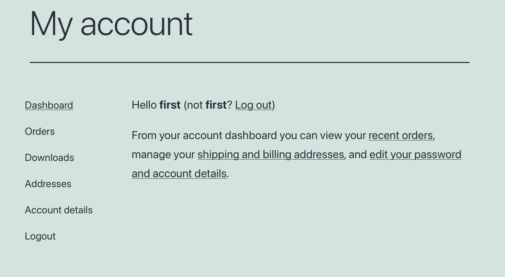
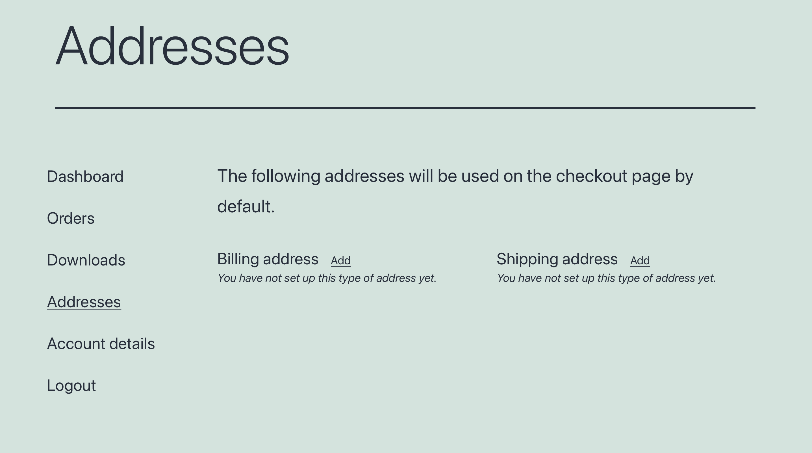
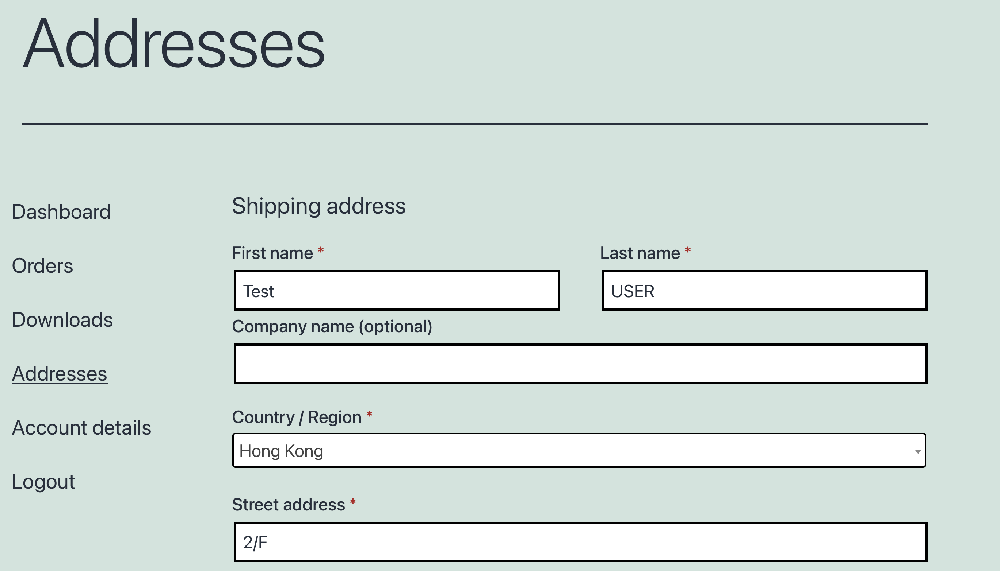
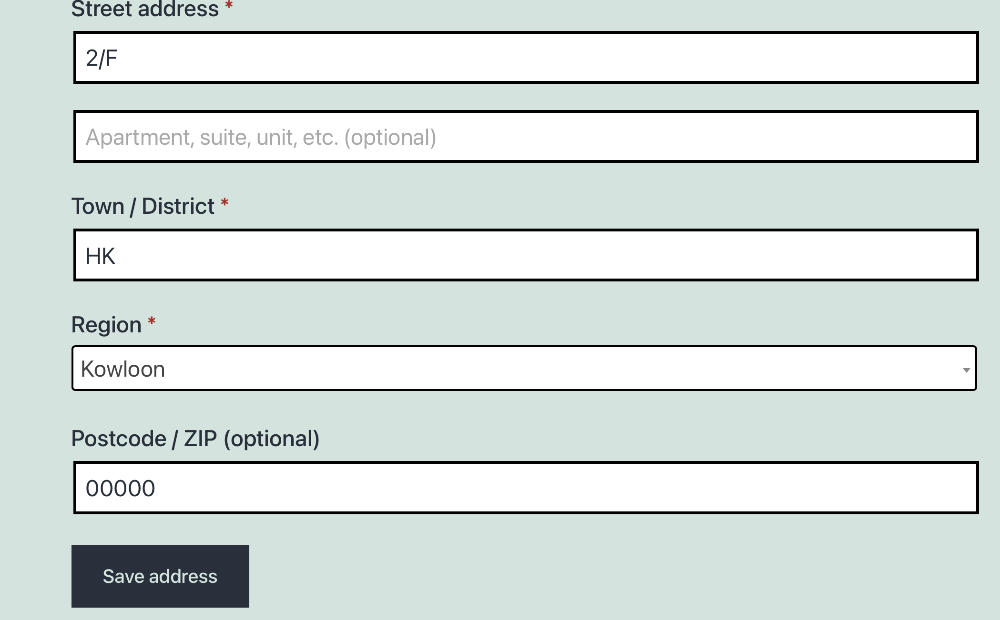
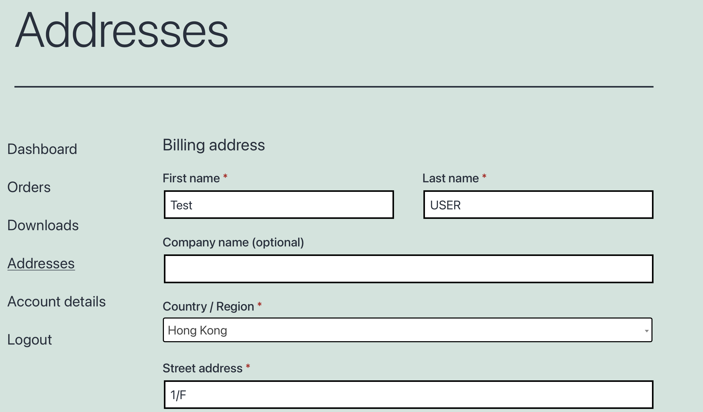
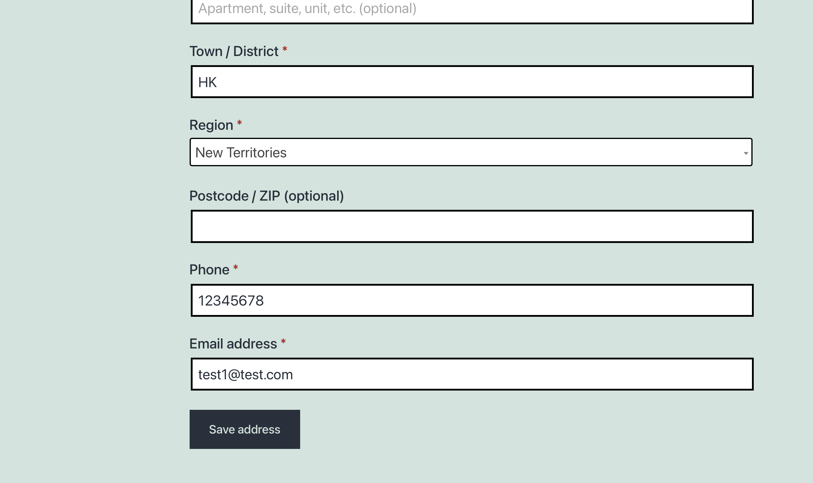
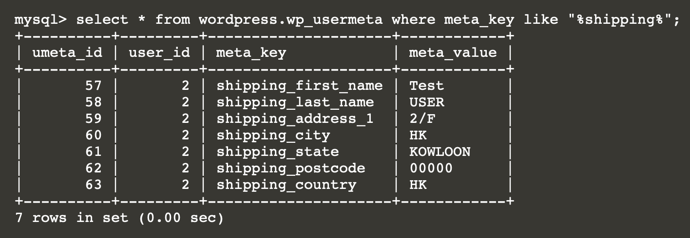
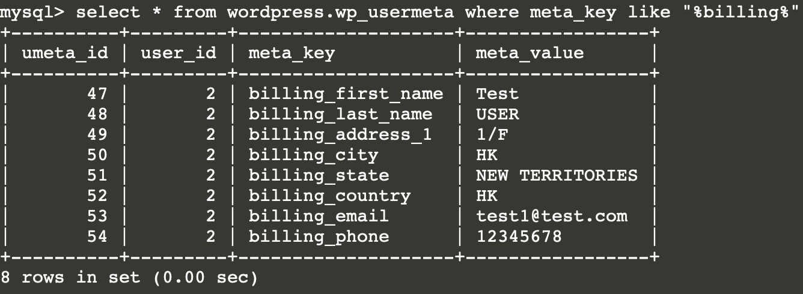

# Address as PII
The billing address and shipping address of each customer is a type of PII . This is a sensitive information that related to customer privacy.

# In the woocommerce website
After you login , select my acocunt to edit the name
Follow the below example

And edit the billing address , shipping address

# Set shipping address
Set the shipping address as following

# Set billing address
Set the billing address as following

# Check for the shipping address
You can view the information related to shipping address by:
 `select * from wordpress.wp_usermeta where meta_key like "%shipping%";`{{execute}}
  
 You will find out the information of first_name ,last_name,city,state,country
  
 which will combine to form an address.

# Check for the billing address
 You can view the information related to billing address by:
 `select * from wordpress.wp_usermeta where meta_key like "%billing%";`{{execute}}
  
 You will find out the information of first_name ,last_name,address,city,state,country
  
 which will combine to form an address.
Also , it will shown user's email and phone as well.

