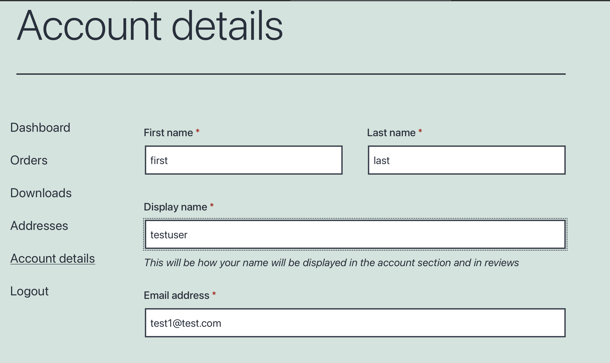

# User Information as PII
The information of each customer is a type of PII . This is a sensitive information that related to customer privacy.

# In the woocommerce website
After you login , select my acocunt
And edit the first name and last name of the user
And press the save changes button
Follow the below example

# Check for the user name
You can view the information related to user name by:
 `select * from wordpress.wp_usermeta where meta_key like "%name%"; `{{execute}}
 You will find out the information about nickname, first_name  and last_name of the user.
 The first_name and last_name will be set as the first name and last name of billing address as well.

# Check for the user email

`select * from wordpress.wp_users;`{{execute}}
We can check user's email from this command as well

# Check for the user password
You can view the information related to user password by:
 `select user_login, user_pass from wordpress. wp_users; `{{execute}}
 You will find out the information about the login name and password of a user

