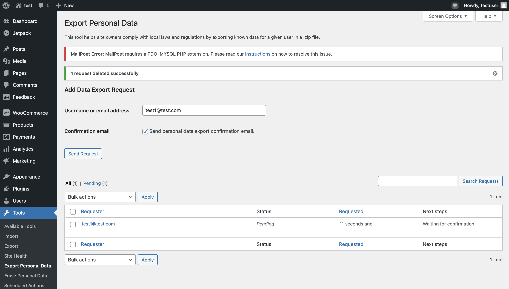
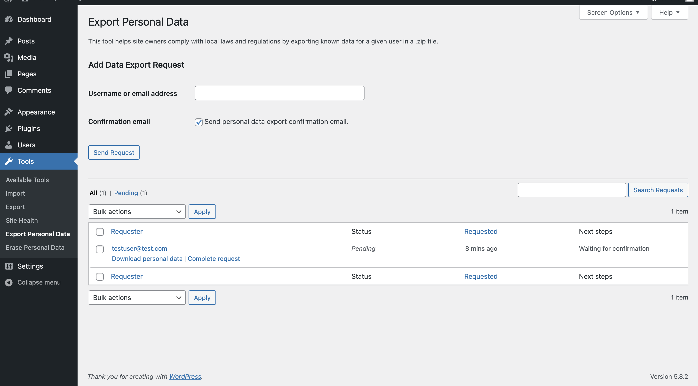
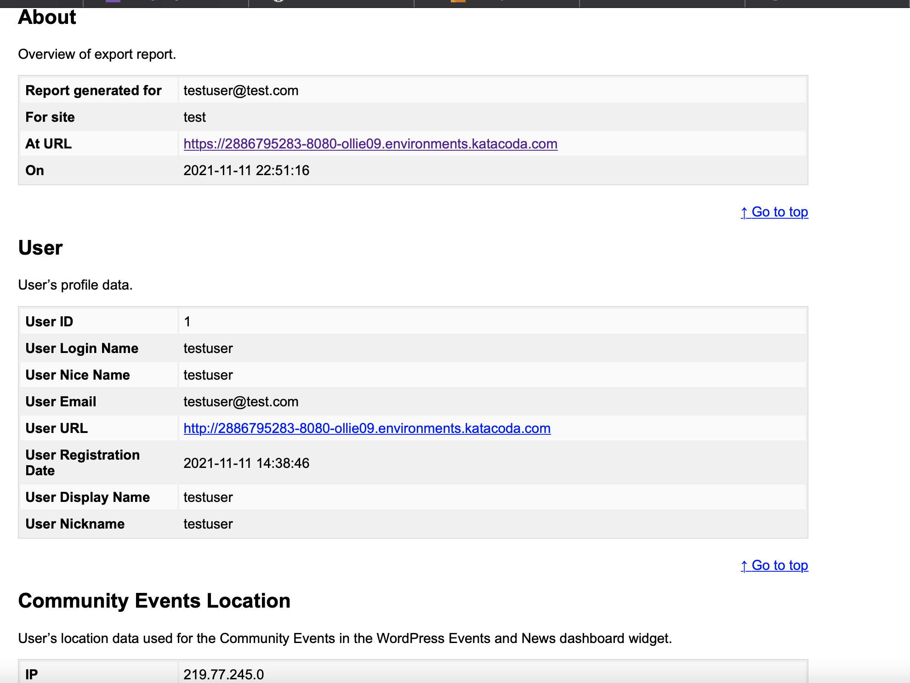

# User can export Information on wordpress
We can export the personal information from wordpress of a specific user.

# In the wordpress website
After you login , enter the setting panel 
And choose export personal data
And download the personal data of the specific user

# After download
You will download a zip file
After export it there are index_html
You may find lots of user data inside
Like User ID , Name, Email and IP

